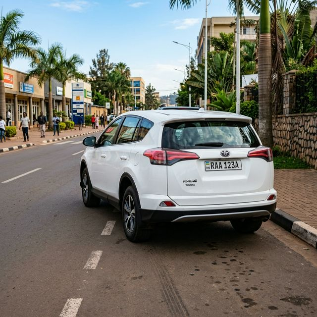
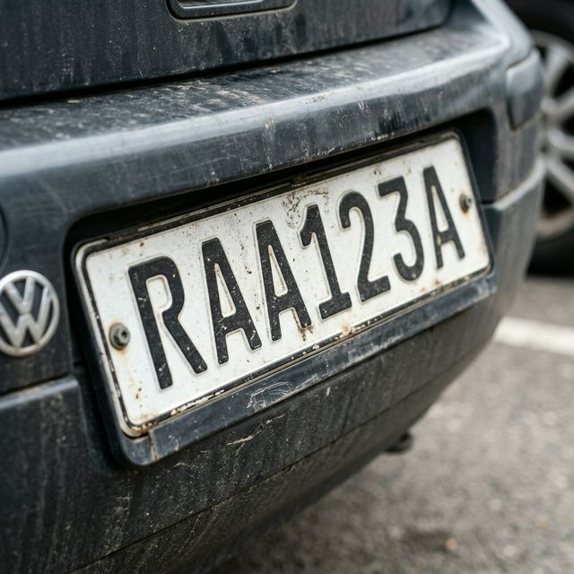
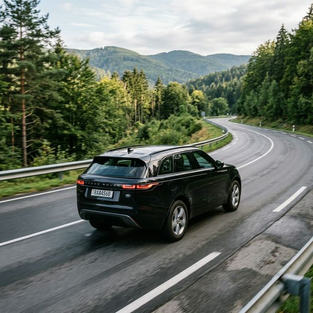

# Car Number Plate Extraction 
## Overview

This project implements a **real-time car number plate recognition system** using computer vision and Optical Character Recognition (OCR). The system captures video from a camera, detects possible license plates, extracts the plate region, reads the characters using OCR, validates the format, and confirms the plate across multiple frames before storing it.

The implementation is divided into **three main stages**:

1. OCR (Optical Character Recognition)
2. Plate Format Validation
3. Temporal Validation

The project is built using **Python, OpenCV, and Tesseract OCR**.

---

# Project Structure


car-number-plate-recognition
│
├── src
│   ├── ocr.py          # Stage 1: Plate detection and OCR
│   ├── validate.py     # Stage 2: OCR validation
│   └── temporal.py     # Stage 3: Temporal confirmation and logging
│
├── plates_log.csv      # Stores detected plate numbers and timestamps
├── README.md
└── requirements.txt


---

# System Pipeline

The system processes each video frame through a **three-step pipeline**.

## 1. Plate Detection and OCR (ocr.py)

In the first stage, the system attempts to detect potential number plates in each frame.

The steps include:

**Image Preprocessing**

* Convert the frame to **grayscale**
* Apply **Gaussian blur** to reduce noise
* Use **Canny edge detection** to highlight edges

**Contour Detection**

* Extract contours from the edge image
* Filter contours using:

  * Minimum contour area
  * Plate-like **aspect ratio**

Contours that satisfy these conditions are considered **plate candidates**.

**Plate Alignment**
A perspective transformation is applied to straighten the detected plate region so it becomes a properly aligned rectangle. This improves OCR accuracy.

**Optical Character Recognition**
The aligned plate image is processed with **Tesseract OCR**, which attempts to extract characters from the plate. OCR is restricted to recognize only:

```
A-Z
0-9
```

---

## 2. Plate Format Validation (validate.py)

OCR can sometimes return noisy or incorrect characters.
The validation stage ensures that the detected text follows a **valid license plate format**.

The system uses a **regular expression pattern**:

[A-Z]{3}[0-9]{3}[A-Z]


Example valid plate:


RAB123C


If the OCR output matches this pattern, the plate is considered **valid**.
Otherwise, it is ignored.

This stage significantly improves the reliability of plate recognition.

---

## 3. Temporal Validation and Logging (temporal.py)

Even with validation, OCR results may vary between frames. To improve stability, the system uses **temporal validation**.

**Frame Buffer**
A buffer stores plate detections from multiple frames.

**Majority Voting**
The system determines the most frequently detected plate within the buffer.

**Plate Confirmation**
If the same plate appears consistently across several frames, it is considered **confirmed**.

**Logging**
Confirmed plates are saved to a CSV file:


plates_log.csv


Each entry contains:

* Plate Number
* Timestamp

Example:


Plate Number, Timestamp
RAB123C, 2026-03-10 14:25:12


A cooldown mechanism prevents the same plate from being logged repeatedly in a short period.

---

# Installation Instructions

Follow the steps below to install and run the project.

## 1. Clone or Download the Project

Download the project folder or clone it from your repository.


git clone <repository-link>
cd car-number-plate-recognition


---

## 2. Create a Virtual Environment (Optional but Recommended)


python -m venv venv


Activate it:

**Windows**

venv\Scripts\activate


**Mac/Linux**


source venv/bin/activate


---

## 3. Install Required Python Libraries

pip install opencv-python numpy pytesseract


---

## 4. Install Tesseract OCR

Download and install **Tesseract OCR** from:

https://github.com/tesseract-ocr/tesseract

After installation, ensure the Tesseract executable is added to your **system PATH**.

---

# Running the System

Run the final stage of the pipeline:


python src/temporal.py

The program will:

1. Open the webcam
2. Detect license plates
3. Perform OCR
4. Validate the detected plate
5. Confirm the plate across multiple frames
6. Save confirmed plates to the CSV log file

Press **q** to exit the program.

---

# Screenshots of Results

| **Detection** |

 |


| **Alignment** |

 |

| **Full Workflow** |

 |

# Features

* Real-time license plate detection
* Automatic plate alignment
* OCR-based character recognition
* License plate format validation
* Temporal verification across frames
* Automatic CSV logging with timestamps
* Lightweight implementation using Python and OpenCV

---

# License

This project is intended for educational and research purposes.
